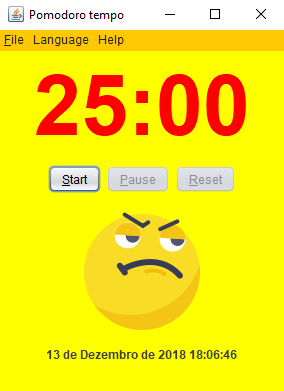
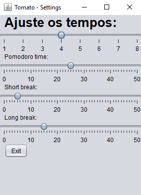

# Tomato

### Free and multi-platform Software to use with the Pomodoro technique.

#### Platforms:
- Windows XP or higher
- GNU/Linux.
- MacOS
#### Requirements:
- JRE 7 or higher
- No Internet required
#### Language support:
- English
- Portuguese
- German
- French
- Spanish
- Klingon
#### Screeshot

#### Download
Click [here](https://drive.google.com/file/d/1lXL2nGChXw0VZUHi_pm6jmKKnsJw94se/view?usp=sharing) to download.

### Licence
 

