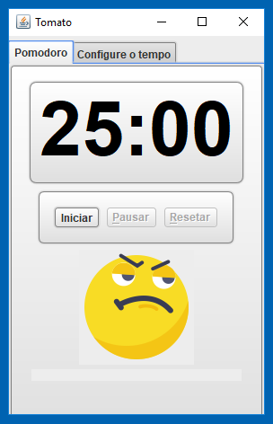

# Tomato

### Free and multi-platform Software to use with the Pomodoro technique.

#### Platforms:
- Windows XP or higher
- GNU/Linux.
- MacOS
#### Requirements:
- JRE 7 or higher
- No Internet required
#### Language support:
- Portuguese
#### Screenshot

#### Download
Click [here](https://drive.google.com/file/d/1bS-rmfkMAeWuEEN-8PpBmzh_36OkBWHP/view?usp=sharing) to download.

### Licence
 

